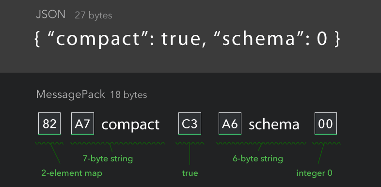
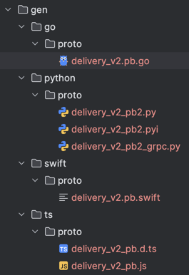
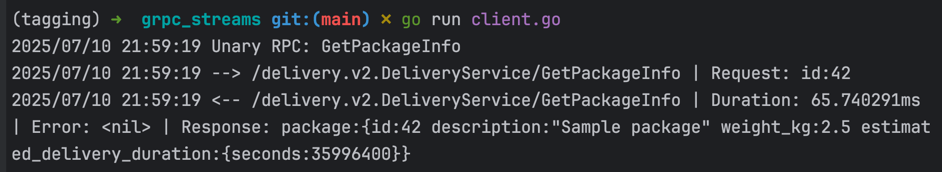
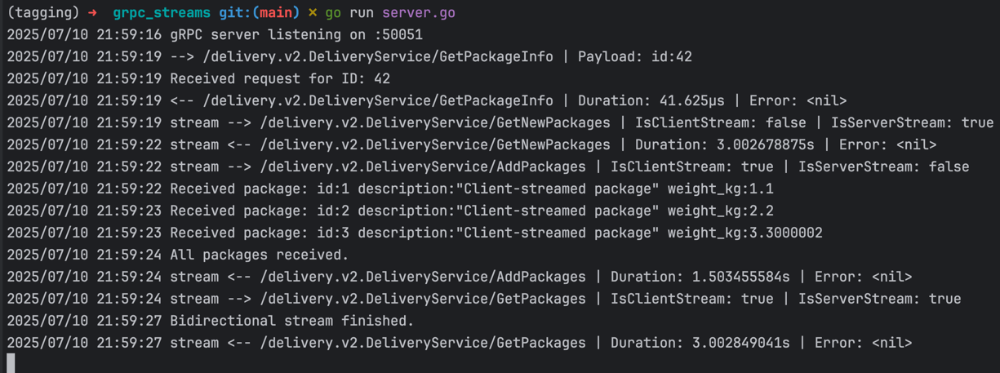

# **Бандос Meet: форматы данных, Protobuf, gRPC, ConnectRPC and more**

Overdone. Illia Dymura 


---
###  JSON: текстовый формат
```json
{
  "device_id": "sensor-abc123",
  "timestamp": "2025-07-10T12:00:00Z",
  "readings": [
    {
      "type": "temperature",
      "value": 22.5,
      "unit": "C"
    },
    {
      "type": "humidity",
      "value": 55.2,
      "unit": "%"
    },
    {
      "type": "pressure",
      "value": 101.3,
      "unit": "kPa"
    }
  ],
  "location": {
    "latitude": 40.7128,
    "longitude": -74.0060,
    "altitude": 10.0
  }
}
```

---

# JSON - текстовый формат, избыточен

- Повтор ключей
- Кавычки, символы-разделители `:`, `,`, `{`, `}` и `[`
- Экранирование

```json
{
  "note": "Line 1\nLine 2 \"quoted text\" \\ path"
}
```

- Нет оптимизации по типам данных - всё передается как строки

---

# MessagePack - drop-in "бинарный json", без схемы



- ~~Кавычки, экранирование, символы-разделители, передача всего как строки~~ ✅
- Ключи остаются

--- 
### Example

```go
import "github.com/vmihailenco/msgpack/v5"

func ExampleMarshal() {
    type Item struct {
        Foo string
    }

    b, err := msgpack.Marshal(&Item{Foo: "bar"})
    if err != nil {
        panic(err)
    }

    var item Item
    err = msgpack.Unmarshal(b, &item)
    if err != nil {
        panic(err)
    }
    fmt.Println(item.Foo)
}
```

---
### Example (with generation) 
https://github.com/tinylib/msgp
```go
//go:generate msgp
type Item struct {
    Name        string    `msgp:"name"`
    Data        []byte    `msgp:"data"`
    Created     time.Time `msgp:"created"`
    Description string    `msgp:"desc"`
}
```

```bash
$ go generate ./...

- item.go
- item_gen.go [generated]
- item_gen_test.go [generated]
```
---

### Example (with generation)
https://github.com/tinylib/msgp

```go
var msg Item

data, err := msg.MarshalMsg(buf) // buf can be nil
```

```go
left, err := msg.UnmarshalMsg(data)
// left - slice of bytes from data
```

---

# BSON

Используется под капотом MongoDB
- несовместимые с json типы данных `ObjectId`, `Min key`, `UUID`, `MD5` (+ можно добавлять свои)
- больше, чем msgpack, но позволяет заменять части данных без полной сериализации (частый кейс в MongoDB)
- имеет те же проблемы, что и MsgPack

Подробнее: https://stackoverflow.com/a/6357042 (ответ от автора MsgPack)

---

### Example

```go
import "go.mongodb.org/mongo-driver/bson"

type Item struct {
    ID    string  `bson:"id"`
    Name  string  `bson:"name"`
    Price float64 `bson:"price"`
}

func ExampleMarshal() {
    var msg Item = Item{
        ID:    "123",
        Name:  "Widget",
        Price: 9.99,
    }
    
    data, err := bson.Marshal(msg)
    if err != nil {
        panic(err)
    }
	
    var item Item
    err = bson.Unmarshal(data, &item)
    if err != nil {
        panic(err)
    }
}
```

---

### Real example

```go
pipeline := mongo.Pipeline{
    {{"$match", bson.D{
        {"created_at", bson.D{{"$gte", oneYearAgo}}},
    }}},
    
    {{"$group", bson.D{
        {"_id", "$category"},
        {"average_price", bson.D{{"$avg", "$price"}}},
        {"total_stock", bson.D{{"$sum", "$stock"}}},
        {"count", bson.D{{"$sum", 1}}},
        {"avg_vendor_rating", bson.D{{"$avg", "$vendor.rating"}}},
    }}},
    
    {{"$sort", bson.D{
        {"total_stock", -1},
    }}},
}

cursor, err := coll.Aggregate(ctx, mongo.Pipeline{groupStage})

var results []bson.M
err = cursor.All(context.TODO(), &results)
```

---
## honorable mention: easyjson
https://github.com/mailru/easyjson (лучше использовать форк)

- Когда нельзя поменять формат, но нужно ускорить работу
- Генерирует функции для marshall/unmarshall'a JSON
- Не использует рефлексию, работает в разы быстрее 

```bash
easyjson -all <file>.go
# generates <file>_easyjson.go
```


```go
someStruct := &SomeStruct{Field1: "val1", Field2: "val2"}
rawBytes, err := easyjson.Marshal(someStruct)
```

```go
err := easyjson.Unmarshal(rawBytes, someStruct)
```

### Минусы: от mail.ru, требует возни с GOPATH
---
### Нерешенная проблема в MsgPack/BSON: запись и повторение ключей

Пример данных:

```RecieverName: Nikita, DestinationAdress: Kyiv..., PhoneNumber: 88002553535```

Варианты решения?

---
### Нерешенная проблема в MsgPack/BSON: запись и повторение ключей

Пример данных:

```RecieverName: Nikita, DestinationAdress: Kyiv..., PhoneNumber: 88002553535```

Варианты решения - добавим контракты

1. Договоримся о конкретном порядке:
   `сначала имя, потом адресс, номер телефона` - наш контракт
   ```Nikita,Kyiv,88002553535``` - данные

---
### Нерешенная проблема в MsgPack/BSON: запись и повторение ключей

Пример данных:

```RecieverName: Nikita, DestinationAdress: Kyiv..., PhoneNumber: 88002553535```

Варианты решения - добавим контракты

1. _Договоримся_ о конкретном порядке:
   `сначала имя, потом адресс, номер телефона` - наш контракт
    ```Nikita,Kyiv,88002553535``` - данные
2. _Договоримся_, что у каждого поля будет свой тег:
   `имя - 1, адресс - 2, номер телефона - 3` - наш контракт
   ```2-Kyiv,1-Nikita,3-88002553535``` - данные


---
### Нерешенная проблема в MsgPack/BSON: запись и повторение ключей

Пример данных:

```RecieverName: Nikita, DestinationAdress: Kyiv..., PhoneNumber: 88002553535```

Варианты решения

1. _Договоримся_ о конкретном порядке:
   `сначала имя, потом адресс, номер телефона` - наш контракт
   ```Nikita,Kyiv,88002553535``` - данные
   <b> --> Apache Avro (жёсткий порядок) </b>
2. _Договоримся_, что у каждого поля будет свой тег:
   `имя - 1, адресс - 2, номер телефона - 3` - наш контракт
   ```2-Kyiv,1-Nikita,3-88002553535``` - данные
   <b> --> Protobuf (порядок не важен, новые поля игнорируются) </b>


---
# Apache Avro - из мира Java, пропускаем

Пример схемы:
```json
{
   "namespace": "example.avro",
   "type": "record",
   "name": "User",
   "fields": [
      {"name": "name", "type": "string"},
      {"name": "favorite_number",  "type": ["null", "int"]},
      {"name": "favorite_color", "type": ["null", "string"]}
   ] 
}
```

https://en.wikipedia.org/wiki/Apache_Avro

---
# Protocol Buffers (Protobuf)
https://protobuf.dev/

from Google


---
# Protobuf: describing messages

`delivery.proto`
```protobuf
syntax = "proto3";

package delivery.v1;
option go_package = "gitlab.com/overdone/delivery-service;deliverypb";

message Person {
   int32 id = 1;
   string name = 2;
   string address = 3;
   string phone_number = 4;
}
```

---

```protobuf
// import example + some types from google
import "google/protobuf/any.proto";
import "google/protobuf/duration.proto";
import "google/protobuf/timestamp.proto";

message Package {
   int32 id = 1;
   string description = 2;
   float weight_kg = 3;
   optional string fragile_note = 4; // explicit optional
   google.protobuf.Duration estimated_delivery_duration = 5;
}

message Person {
   reserved 1; // deprecated, removed 'id' field
   string name = 2;
   string address = 3;

   oneof contact_method {
      string telegram_handle = 4;
      string whatsapp_number = 5 [deprecated = true]; // deprecated without field deletion
   }

   google.protobuf.Timestamp created_at = 10; // time
   repeated Package packages = 11; // array

   map<string, string> metadata = 12; // map
}
```

---

# Protobuf: generation via protoc
1. Install `protoc` https://protobuf.dev/installation/

```bash
$ apt install -y protobuf-compiler # linux

$ brew install protobuf # mac os
```

```protobuf
$ protoc --version
libprotoc 29.3
```

2. Install protoc-gen-go plugin

```bash
$ go install google.golang.org/protobuf/cmd/protoc-gen-go@latest
```

--- 

# Protobuf: generation via protoc
3. Run `protoc`
```bash
protoc \
  --proto_path=. \
  --go_out=gen \
  --go_opt=paths=source_relative \ # important
  delivery_v2.proto
```
Result:
```bash
proto
├── delivery_v2.proto
└── gen
    └── delivery_v2.pb.go # <----
```

---
#### Protobuf: usage

```go
person := &deliverypb.Person{
	Name:    "Nikita",
	Address: "Kyiv",
	ContactMethod: &deliverypb.Person_TelegramHandle{ // oneof, use wrapper type
		TelegramHandle: "@aboba",
	},
	CreatedAt: timestamppb.Now(),
	Packages: []*deliverypb.Package{
		{
			Id:                        1,
			Description:               "Smartphone",
			WeightKg:                  0.5,
			EstimatedDeliveryDuration: durationpb.New(48 * time.Hour),
		},
	},
	Metadata: map[string]string{
		"priority": "high",
		"source":   "mobile_app",
	},
}

data, err := proto.Marshal(person)
if err != nil {
	log.Fatal("Failed to marshal:", err)
}
```
---
#### Protobuf: usage

```go
decoded := new(deliverypb.Person)
if err = proto.Unmarshal(data, decoded); err != nil {
    log.Fatal("Failed to unmarshal:", err)
}

switch contact := decoded.ContactMethod.(type) {
    case *deliverypb.Person_TelegramHandle:
        fmt.Println("Telegram:", contact.TelegramHandle)
    case *deliverypb.Person_WhatsappNumber:
        fmt.Println("WhatsApp:", contact.WhatsappNumber)
    default:
        fmt.Println("No contact method provided")
}
```
---

# Protobuf: use buf.build for generation

1. Install
```bash
$ go install github.com/bufbuild/buf/cmd/buf@latest
```
2. Add `buf.yaml`

```yaml
version: v2
lint:
  use:
    - STANDARD
deps:
  - buf.build/bufbuild/protovalidate # will be used later
breaking: # breaking change detection
  use:
    - FILE
```
---
# Protobuf: use buf.build for generation

3. Add `buf.gen.yaml`
```yaml
version: v2
plugins:
  - local: protoc-gen-go
    out: gen/go
    opt: paths=source_relative
```
4. Run
```bash
$ buf generate
```

---

# Protobuf: use buf.build for generation

3. Add `buf.gen.yaml`
```yaml
version: v2
plugins:
  - local: protoc-gen-go
    out: gen/go
    opt: paths=source_relative
```

4. Run
```bash
$ buf generate
```

---

# Protobuf: use buf.build for generation
Output



---

# gRPC

- https://grpc.io/
- Разработан Google
- RPC (Remote Procedure Call) протокол на основе HTTP/2
- Использует Protobuf
- Генерирует код для сервера/клиента
- Request/Response коммуникация + двунаправленный стриминг сообщений
- Имеет кучу расширений

---


# gRPC: define service

 `delivery_v2.proto`:

```protobuf
syntax = "proto3";
package delivery.v2;
...

service DeliveryService {
  rpc GetPackageInfo(GetPersonInfoRequest) returns (GetPersonInfoResponse);
}

message GetPersonInfoRequest {
  int32 id = 1;
}

message GetPersonInfoResponse {
  Package package = 1;
}
```

---
# gRPC: generate code

Add to `buf.gen.yaml`
```yaml
version: v2
plugins:
  - local: protoc-gen-go
    out: gen/go
    opt: paths=source_relative
  - local: protoc-gen-go-grpc # <--- new
    out: gen/go
    opt: paths=source_relative
```

```bash
$ buf generate
# file delivery_v2_grpc.pb.go is generated
```

--- 

# gRPC: Implementing server side

```go
type DeliveryService struct {
    deliverypb.UnimplementedDeliveryServiceServer
}

func (s *DeliveryService) GetPackageInfo(ctx context.Context, req *deliverypb.GetPersonInfoRequest) (
    *deliverypb.GetPersonInfoResponse, error,
) {
    // server logic...
	
    log.Printf("Received request for ID: %d", req.Id)
	
    return &deliverypb.GetPersonInfoResponse{
        Package: &deliverypb.Package{
            Id:                        req.Id,
            Description:               "Sample package",
            WeightKg:                  2.5,
            FragileNote:               nil,
            EstimatedDeliveryDuration: durationpb.New(time.Hour * 9999), // will not be delivered...
        },
    }, nil
}
```

---

# gRPC: Implementing server side

```go
func main() {
    lis, err := net.Listen("tcp", ":50051")
    if err != nil {
        log.Fatalf("failed to listen: %v", err)
    }
    
    s := grpc.NewServer()
    deliverypb.RegisterDeliveryServiceServer(s, &DeliveryService{})
    
    log.Println("gRPC server listening on :50051")
    if err = s.Serve(lis); err != nil {
        log.Fatalf("failed to serve: %v", err)
    }
}
```

---

# gRPC: Implementing client side

```go
conn, err := grpc.Dial("localhost:50051", 
	grpc.WithTransportCredentials(insecure.NewCredentials()),
)
if err != nil {
    log.Fatalf("could not connect to server: %v", err)
}
defer conn.Close()

client := deliverypb.NewDeliveryServiceClient(conn)

req := &deliverypb.GetPersonInfoRequest{Id: 123}

resp, err := client.GetPackageInfo(context.TODO(), req)
if err != nil {
    log.Fatalf("error while calling GetPackageInfo: %v", err)
}

spew.Dump(resp)
```

---

Running 
```bash
$ go run server.go
# running

$$ go run client.go

2025/07/10 21:21:46 Package Info:
- ID: 123
- Description: Sample package
- Weight: 2.50kg
- ETA: 9999h0m0s
```

---
# gRPC: streaming

```protobuf
service DeliveryService {
  rpc GetPackageInfo(GetPackageInfoRequest) returns (GetPackageInfoResponse);
  // directional stream
  rpc GetNewPackages(GetPackageInfoRequest) returns (stream Package);
  rpc AddPackages(stream Package) returns (stream AddPackageResponse);
  // bidirectional stream
  rpc GetPackages(stream GetPackageInfoRequest) returns (stream GetPackageInfoResponse);
}

message AddPackageResponse {
  int32 added_count = 1;
}
```
```bash
$ buf generate
```


---
# gRPC: server: streaming from server

```go
func (s *DeliveryService) GetNewPackages(
	req *deliverypb.GetPackageInfoRequest, stream deliverypb.DeliveryService_GetNewPackagesServer, 
) error {
	
	// our logic
	
	for i := 1; i <= 3; i++ {
		pkg := &deliverypb.Package{
			Id:                        req.Id + int32(i),
			Description:               "Streamed package",
			WeightKg:                  float32(i),
			EstimatedDeliveryDuration: durationpb.New(time.Minute * time.Duration(i*10)),
		}
		if err := stream.Send(pkg); err != nil {
			return err
		}
		time.Sleep(time.Second)
	}
	return nil
}
```

---
# gRPC: server: streaming from client

```go
func (s *DeliveryService) AddPackages(stream deliverypb.DeliveryService_AddPackagesServer) error {
    var count int32
    for {
        pkg, err := stream.Recv()
        if err == io.EOF {
            log.Println("All packages received.")
            return stream.SendAndClose(&deliverypb.AddPackageResponse{
                AddedCount: count,
            })
        }
        if err != nil {
            return err
        }
        log.Printf("Received package: %+v", pkg)
        count++
    }
}
```

---
# gRPC: bidirectional streaming

```go
func (s *DeliveryService) GetPackages(stream deliverypb.DeliveryService_GetPackagesServer) error {
    for {
        req, err := stream.Recv()
        if err == io.EOF {
            log.Println("Bidirectional stream finished.")
            return nil
        }
        if err != nil {
            return err
        }
        
        resp := &deliverypb.GetPackageInfoResponse{
            Package: &deliverypb.Package{
                Id:                        req.Id,
                Description:               "Bi-directional response",
                WeightKg:                  1.5,
                EstimatedDeliveryDuration: durationpb.New(time.Minute * 15),
            },
        }
        if err = stream.Send(resp); err != nil {
            return err
        }
    }
}
```

---

# gRPC: Interceptors

- Мидлвари из обычных API
- Делятся на два типа:
   - Unary interceptors: для request->response RPC
   - Stream interceptors: для stream RPC
- Можно чейнить

```go
opts := []grpc.ServerOption{
	grpc.UnaryInterceptor(unaryServerInterceptor),
	grpc.StreamInterceptor(streamServerInterceptor),
}
s := grpc.NewServer(opts...)
```

---

# gRPC: Interceptors

- Мидлвари из обычных API
- Делятся на два типа:
   - Unary interceptors: для request->response RPC
   - Stream interceptors: для `stream` RPC
- Можно чейнить
- Можно настроить что для сервера, что для клиента
- Usecases: logging, tracing, authorization...

---

# gRPC: Server Interceptors


```go
func unaryServerInterceptor(
    ctx context.Context, req any, info *grpc.UnaryServerInfo, handler grpc.UnaryHandler,
) (any, error) {
    start := time.Now()
    log.Printf("--> %s | Payload: %+v", info.FullMethod, req)
    resp, err := handler(ctx, req)
    log.Printf("<-- %s | Duration: %s | Error: %v", info.FullMethod, time.Since(start), err)
    return resp, err
}

func streamServerInterceptor(
    srv any, ss grpc.ServerStream, info *grpc.StreamServerInfo, handler grpc.StreamHandler,
) error {
    start := time.Now()
    log.Printf("stream --> %s | IsClientStream: %t | IsServerStream: %t",
    info.FullMethod, info.IsClientStream, info.IsServerStream)
    err := handler(srv, ss)
    log.Printf("stream <-- %s | Duration: %s | Error: %v", info.FullMethod, time.Since(start), err)
    return err
}

...

func main() {
    opts := []grpc.ServerOption{
    	grpc.UnaryInterceptor(unaryServerInterceptor),
    	grpc.StreamInterceptor(streamServerInterceptor),
    }
    s := grpc.NewServer(opts...)
```

---

# gRPC: Client Interceptors

```go
func unaryClientInterceptor(
	ctx context.Context, method string,
	req, reply any, cc *grpc.ClientConn,
	invoker grpc.UnaryInvoker, opts ...grpc.CallOption,
) error {
	start := time.Now()
	log.Printf("--> %s | Request: %+v", method, req)

	err := invoker(ctx, method, req, reply, cc, opts...)

	log.Printf("<-- %s | Duration: %s | Error: %v | Response: %+v",
		method, time.Since(start), err, reply)
	return err
}

func main() {
    conn, err := grpc.NewClient("localhost:50051",
        grpc.WithTransportCredentials(insecure.NewCredentials()),
        grpc.WithUnaryInterceptor(unaryClientInterceptor),
    )
```

---





---

# gRPC: multiple interceptors

```go
opts := []grpc.ServerOption{
	grpc.ChainUnaryInterceptor(
		loggingInterceptor,
		authInterceptor,
	),
	grpc.StreamInterceptor(streamServerInterceptor),
}
```

---

# gRPC: Validation

```protobuf
import "buf/validate/validate.proto";

message GetPackageInfoRequest {
  int32 id = 1 [(buf.validate.field).int32.gt = 0];
}

// other example
message AddPostRequest {
  string upload_session_key = 2 [(buf.validate.field).string.min_len = 1];
  optional string soundcloud_song = 7 [(buf.validate.field).string.min_len = 1];
  optional int32 soundcloud_song_start = 8 [(buf.validate.field).int32.gte = 0];
  string description = 9 [(buf.validate.field).string.min_len = 1];
}

```
---

# gRPC: Validation

`buf.yaml`: add `buf.build/bufbuild/protovalidate`
```yaml
version: v2
lint:
  use:
    - STANDARD
deps:
  - buf.build/bufbuild/protovalidate # <--
breaking:
  use:
    - FILE
```
```bash
$ buf generate
```

---

# gRPC: Validation

```bash
$ go get buf.build/go/protovalidate
```

```go
import "buf.build/go/protovalidate"

func (s *DeliveryService) GetPackageInfo(ctx context.Context, req *deliverypb.GetPackageInfoRequest) (
	*deliverypb.GetPackageInfoResponse, error,
) {
	if err := protovalidate.Validate(req); err != nil {
		return nil, status.Error(codes.InvalidArgument, err.Error())
	}
	
	...
}
```


```bash
$ go run client.go # sends package id -44
2025/07/10 22:11:50 error calling GetPackageInfo: rpc error: code = InvalidArgument desc = validation error:
 - id: value must be greater than 0 [int32.gt]
exit status 1
```

--- 

# More:

- https://buf.build/docs/protovalidate/ - list of all supported checks

```protobuf
message FlightChangeRequest {
  string first_name = 1 [
    (buf.validate.field).required = true,
    (buf.validate.field).string.max_len = 50,
    (buf.validate.field).string.pattern = "^[a-zA-Z]+$"
  ];
  google.protobuf.Timestamp departure_time = 1 [
    (buf.validate.field).timestamp.gt_now = true,
    (buf.validate.field).cel = {
      id: "departure_time.within_window"
      message: "departure time must not be more than 72 hours from now"
      expression: "this <= now + duration('72h')"
    }
  ];
}
```

--- 

# Next

- https://google.aip.dev/general
- ConnectRPC: workshop
- grpc-gateway: workshop
- Использование с вебом


